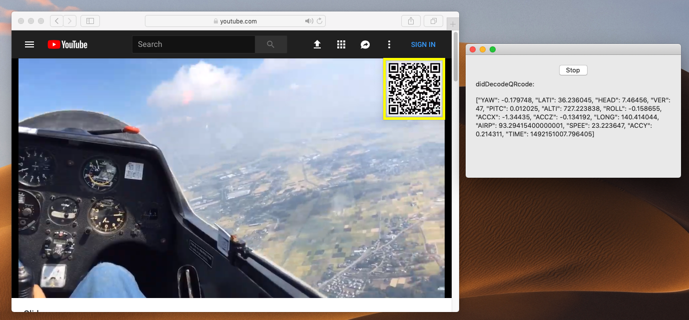

# SenbayKit-macOS

[](https://travis-ci.org/tetujin/SenbayKit-macOS)
[](https://cocoapods.org/pods/SenbayKit-macOS)
[](https://cocoapods.org/pods/SenbayKit-macOS)
[](https://cocoapods.org/pods/SenbayKit-macOS)

**SenbayKit-macOS** is a development library for adding Senbay functions into your macOS application.

<p align="center">

</p>

## Requirements
SenbayKit requires macOS 10.10 or later. This library supports both **Swift** and **Objective-C**. The sample code is written in Swift.


## Installation

SenbayKit-macOS is available through [CocoaPods](https://cocoapods.org). To install
it, simply add the following line to your Podfile:

```ruby
pod 'SenbayKit-macOS'
```

## How to use

###  Settings
1. Setup Info.plist
Please add following keys to Info.plist
- NSCameraUsageDescription

2. Setup capabilities
Capabilities  -> App SandBox ->  Hardware -> Camera


### Senbay Reader

1. Import SenbayKit into your source code
```swift
import SenbayKit_macOS;
```

2. Add SenbayReaderDelegate into your NSViewController
```swift
class ViewController: NSViewController, SenbayReaderDelegate {
    // some codes here
}
```
3. Initialize and start SenbayReader

```swift
var reader = SenbayReader()
reader.delegate = self;
reader.start()
```

4. Receive detected and decoded data via SenbayReaderDelegate
```swift
func didDetectQRcode(_ qrcode: String)
func didDecodeQRcode(_ senbayData: [String : Any])
func didChangeCaptureArea(_ rect: CGRect) {
```

5. (Option) Set the capture area

You can adjust the capture area of SenbayReader by `setCaptureAreaWith(_ rect:CGRect)` method on SenbayReader.
```swift
func setCaptureAreaWith(_ rect: CGRect)
```
Moreover, SenbayReader has `adjustCaptureArea()` method. Just by calling this method, SenbayReader automatically detect a QRcode on your target screen, and adjust the capture area depend on the QRcode size and position.

6. (Option) Set configuration of SenbayReader

`SenbayReaderConfig` class manages the configuration of SenbayReader.

```swift
// EXAMPLE-1
let CONFIG = SenbayReaderConfig{config in
    config.frequency = 30
    config.captureAreaX = 0
    config.captureAreaY = 0
    config.captureAreaWidth  = 200
    config.captureAreaHeight = 200
}
let reader = SenbayReader(config: CONFIG)
reader.start()
```

```swift
// EXAMPLE-2
let reader = SenbayReader()
reader.config.frequency = 30
reader.start()
```

## Author and Contributors

SenbayKit is authord by [Yuuki Nishiyama](http://www.yuukinishiyama.com). In addition, [Takuro Yonezawa](https://www.ht.sfc.keio.ac.jp/~takuro/), [Denzil Ferreira](http://www.oulu.fi/university/researcher/denzil-ferreira), [Anind K. Dey](http://www.cs.cmu.edu/~anind/), [Jin Nakazawa](https://keio.pure.elsevier.com/ja/persons/jin-nakazawa) are deeply contributing this project. Please see more detail information on our [website](http://www.senbay.info).

## Related Links
* [Senbay Platform Offical Website](http://www.senbay.info)
* [Senbay YouTube Channel](https://www.youtube.com/channel/UCbnQUEc3KpE1M9auxwMh2dA/videos)

## Citation
Please cite these papers in your publications if it helps your research:

```
@inproceedings{Nishiyama:2018:SPI:3236112.3236154,
author = {Nishiyama, Yuuki and Dey, Anind K. and Ferreira, Denzil and Yonezawa, Takuro and Nakazawa, Jin},
title = {Senbay: A Platform for Instantly Capturing, Integrating, and Restreaming of Synchronized Multiple Sensor-data Stream},
booktitle = {Proceedings of the 20th International Conference on Human-Computer Interaction with Mobile Devices and Services Adjunct},
series = {MobileHCI '18},
year = {2018},
location = {Barcelona, Spain},
publisher = {ACM},
}
```

## License
SenbayKit is available under the Apache License, Version 2.0 license. See the LICENSE file for more info.
